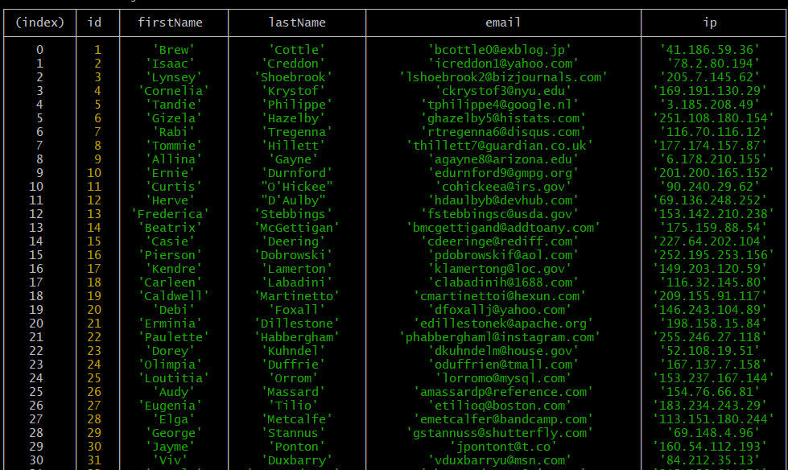

# First-backend-app

Exercises
Install the node-postgres library, by running the following command into your project:

npm install pg
Find a table structure so you can store the users into your newly created postgres database
Create the table using Node.js
Using a for loop, fill in the table using Node.js

